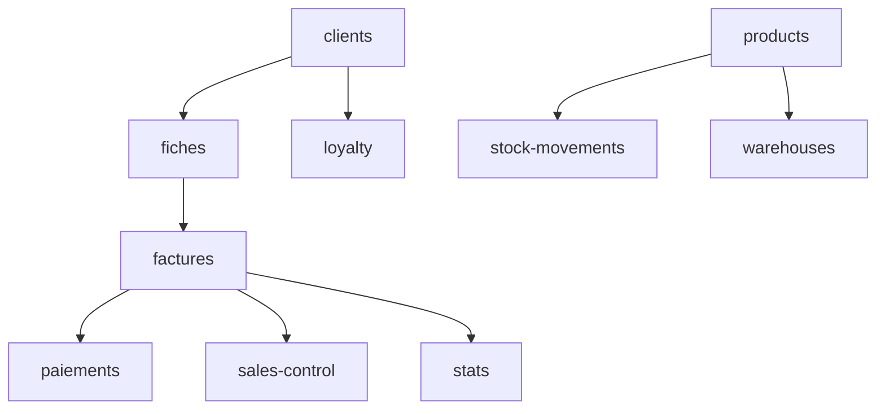

# 🗺️ OptiSaas - Carte des Modules et Responsabilités

## Backend Modules (13)

### 📍 Module: centers
**Chemin**: `backend/src/features/centers/`
**Responsable**: [À assigner]
**Endpoints**:
- `GET /centers` - Liste des centres
- `POST /centers` - Créer un centre
- `PUT /centers/:id` - Modifier un centre
- `DELETE /centers/:id` - Supprimer un centre

---

### 📍 Module: clients
**Chemin**: `backend/src/features/clients/`
**Responsable**: [À assigner]
**Endpoints**:
- `GET /clients` - Liste des clients
- `POST /clients` - Créer un client
- `PUT /clients/:id` - Modifier un client
- `GET /clients/:id/fiches` - Fiches du client

---

### 📍 Module: factures
**Chemin**: `backend/src/features/factures/`
**Responsable**: [À assigner]
**Endpoints**:
- `GET /factures` - Liste des factures
- `POST /factures` - Créer une facture
- `PUT /factures/:id` - Modifier une facture
- `POST /factures/:id/validate` - Valider une facture

---

### 📍 Module: fiches
**Chemin**: `backend/src/features/fiches/`
**Responsable**: [À assigner]
**Endpoints**:
- `GET /fiches` - Liste des fiches
- `POST /fiches` - Créer une fiche
- `PUT /fiches/:id` - Modifier une fiche
- `GET /fiches/:id/facture` - Facture liée

---

### 📍 Module: groups
**Chemin**: `backend/src/features/groups/`
**Responsable**: [À assigner]
**Endpoints**:
- `GET /groups` - Liste des groupes
- `POST /groups` - Créer un groupe
- `PUT /groups/:id` - Modifier un groupe

---

### 📍 Module: loyalty
**Chemin**: `backend/src/features/loyalty/`
**Responsable**: [À assigner]
**Endpoints**:
- `GET /loyalty/config` - Configuration fidélité
- `POST /loyalty/config` - Mettre à jour config
- `POST /loyalty/redeem` - Échanger points

---

### 📍 Module: paiements
**Chemin**: `backend/src/features/paiements/`
**Responsable**: [À assigner]
**Endpoints**:
- `GET /paiements` - Liste des paiements
- `POST /paiements` - Créer un paiement
- `GET /paiements/facture/:id` - Paiements d'une facture

---

### 📍 Module: products
**Chemin**: `backend/src/features/products/`
**Responsable**: [À assigner]
**Endpoints**:
- `GET /products` - Liste des produits
- `POST /products` - Créer un produit
- `PUT /products/:id` - Modifier un produit
- `GET /products/stats` - Statistiques stock

---

### 📍 Module: sales-control
**Chemin**: `backend/src/features/sales-control/`
**Responsable**: [À assigner]
**Endpoints**:
- `GET /sales-control/dashboard-data` - Données dashboard
- `GET /sales-control/statistics` - Stats par vendeur
- `POST /sales-control/validate/:id` - Valider facture

---

### 📍 Module: stats ⭐ NOUVEAU
**Chemin**: `backend/src/features/stats/`
**Responsable**: [À assigner]
**Endpoints**:
- `GET /stats/summary` - Résumé global
- `GET /stats/revenue-evolution` - Évolution CA
- `GET /stats/product-distribution` - Répartition produits
- `GET /stats/conversion-rate` - Taux de conversion
- `GET /stats/stock-by-warehouse` - Stock par entrepôt
- `GET /stats/top-clients` - Top clients
- `GET /stats/payment-methods` - Méthodes de paiement

---

### 📍 Module: stock-movements
**Chemin**: `backend/src/features/stock-movements/`
**Responsable**: [À assigner]
**Endpoints**:
- `GET /stock-movements` - Liste des mouvements
- `POST /stock-movements` - Créer un mouvement

---

### 📍 Module: users
**Chemin**: `backend/src/features/users/`
**Responsable**: [À assigner]
**Endpoints**:
- `GET /users` - Liste des utilisateurs
- `POST /users` - Créer un utilisateur
- `PUT /users/:id` - Modifier un utilisateur

---

### 📍 Module: warehouses
**Chemin**: `backend/src/features/warehouses/`
**Responsable**: [À assigner]
**Endpoints**:
- `GET /warehouses` - Liste des entrepôts
- `POST /warehouses` - Créer un entrepôt
- `GET /warehouses/:id` - Détail entrepôt

---

## Frontend Modules (12)

### 🎨 Module: authentication
**Chemin**: `frontend/src/app/features/authentication/`
**Responsable**: [À assigner]
**Pages**:
- Login
- Register
- Forgot Password

---

### 🎨 Module: centers
**Chemin**: `frontend/src/app/features/centers/`
**Responsable**: [À assigner]
**Composants**:
- `center-list.component` - Liste des centres
- `center-form-dialog.component` - Formulaire centre

---

### 🎨 Module: client-management
**Chemin**: `frontend/src/app/features/client-management/`
**Responsable**: [À assigner]
**Composants**:
- `client-list.component` - Liste clients
- `client-detail.component` - Détail client
- `lentilles-form.component` - Fiche lentilles
- `monture-form.component` - Fiche monture
- `facture-form.component` - Formulaire facture
- `payment-list.component` - Liste paiements

---

### 🎨 Module: dashboard
**Chemin**: `frontend/src/app/features/dashboard/`
**Responsable**: [À assigner]
**Composants**:
- `dashboard.component` - Tableau de bord principal

---

### 🎨 Module: groups
**Chemin**: `frontend/src/app/features/groups/`
**Responsable**: [À assigner]
**Composants**:
- `groups-list.component` - Liste groupes
- `group-detail.component` - Détail groupe
- `group-form-dialog.component` - Formulaire groupe

---

### 🎨 Module: measurement
**Chemin**: `frontend/src/app/features/measurement/`
**Responsable**: [À assigner]
**Composants**:
- `camera-view.component` - Vue caméra
- `measurement-form.component` - Formulaire mesures

---

### 🎨 Module: reports
**Chemin**: `frontend/src/app/features/reports/`
**Responsable**: [À assigner]
**Composants**:
- `sales-control-report.component` - Contrôle des ventes
- `advanced-stats.component` ⭐ NOUVEAU - Statistiques avancées

---

### 🎨 Module: settings
**Chemin**: `frontend/src/app/features/settings/`
**Responsable**: [À assigner]
**Composants**:
- `loyalty-config.component` - Configuration fidélité

---

### 🎨 Module: stock-management
**Chemin**: `frontend/src/app/features/stock-management/`
**Responsable**: [À assigner]
**Composants**:
- `product-list.component` - Liste produits
- `product-form.component` - Formulaire produit
- `stock-transfer-dialog.component` - Transfert stock
- `stock-search-dialog.component` - Recherche stock

---

### 🎨 Module: user-management
**Chemin**: `frontend/src/app/features/user-management/`
**Responsable**: [À assigner]
**Composants**:
- `user-list.component` - Liste utilisateurs
- `user-form.component` - Formulaire utilisateur

---

### 🎨 Module: warehouses
**Chemin**: `frontend/src/app/features/warehouses/`
**Responsable**: [À assigner]
**Composants**:
- `warehouse-list.component` - Liste entrepôts
- `warehouse-detail.component` - Détail entrepôt
- `warehouse-form-dialog.component` - Formulaire entrepôt

---

## 📋 Tableau d'Attribution (À compléter)

| Développeur | Modules Backend | Modules Frontend |
|-------------|----------------|------------------|
| Dev 1 | | |
| Dev 2 | | |
| Dev 3 | | |
| Dev 4 | | |

---

## 🔄 Dépendances entre Modules

---

**Note**: Cette carte doit être mise à jour à chaque ajout/modification de module.
